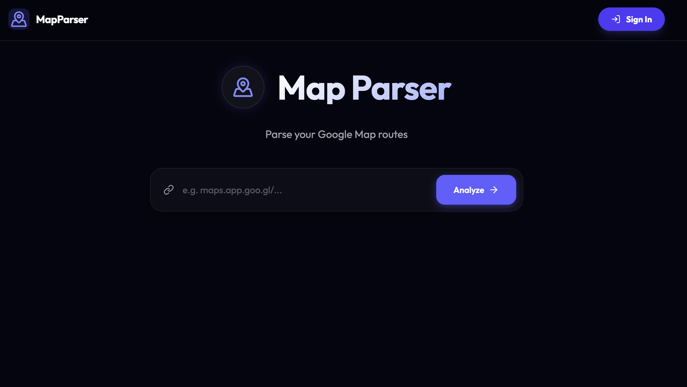

# MapParser

**MapParser** is a modern, beautiful web and mobile app designed to bridge the gap between shared Google Maps routes and your personal Google My Maps. Use it to extract waypoints from directions links and export them for easy import into other tools. You can also parse, save, and manage your trips and waypoints for future use.

## Access

Access the application via the following web or mobile app.

### 1. Website

You can access the online website at https://mapparser.travel-tracker.org. The main page is shown below:

### 2. iOS or Android App

You can scan the QR code below to download the app from the App Store or Google Play.

## Features

- **Instant Analysis**: Paste any Google Maps direction link (e.g., `https://maps.app.goo.gl/...`), and MapParser would extract all of the waypoints and coordinates.

- **Route Preview**:
  - **OpenStreetMap**: View your route immediately on an interactive OpenStreetMap with A, B, C, ... markers.
  - **Google Maps**: Toggle a Google Maps view for familiar navigation.

- **Export Options**:
  - **CSV**: optimized for the Google My Maps "Import" feature.
  - **KML**: Standard geospatial format for Google Earth and other GIS tools.

- **Save & Manage Trips**:
  - **Sign in**: Sign in with Google or Apple to save your trips.
  - **My Trips**: View and manage your saved trips.
  - **Trip Details**: View trip details and waypoints.
  - **Edit Trips**: Edit trip details and waypoints.
  - **Delete Trips**: Delete trips.

- **Premium Design**: A dark, glassmorphism-inspired UI with smooth Framer Motion animations.

- **Privacy First**: All processing happens on demand in your browser or via serverless functions; no personal location data is stored permanently.

## Contact

For questions, suggestions, or feedback, please contact maintainer: **changzhiai@gmail.com**

